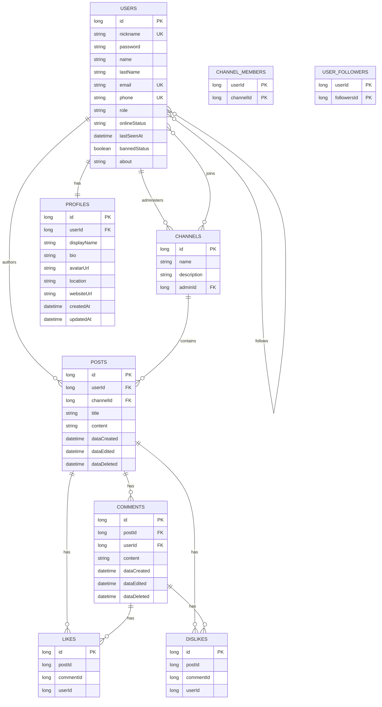

# Entity Schema

This document describes the current JPA entities and their database shape.

## ER Diagram



## User

Java class: `org.example.entity.User`

Database table: `users`

| Field | Column | Type | Notes |
| --- | --- | --- | --- |
| `id` | `id` | `bigserial` | Primary key |
| `nickname` | `nickname` | `varchar(255)` | Required, unique in JPA |
| `password` | `password` | `varchar(255)` | Required in JPA |
| `name` | `name` | `varchar(255)` | Nullable |
| `lastName` | `last_name` | `varchar(255)` | Nullable |
| `email` | `email` | `varchar(255)` | Unique in JPA |
| `phone` | `phone` | `varchar(255)` | Unique in JPA |
| `role` | `role` | `varchar(255)` | Enum: `ADMIN`, `USER`; required |
| `onlineStatus` | `online_status` | `varchar(255)` | Enum: `ONLINE`, `OFFLINE`; required |
| `lastSeenAt` | `last_seen_at` | `timestamp(6)` | Nullable |
| `bannedStatus` | `banned_status` | `boolean` | Defaults to `false` |
| `about` | `about` | `varchar(255)` | Nullable |

Relationships:

| Field | Relationship | Database mapping |
| --- | --- | --- |
| `posts` | `@OneToMany(mappedBy = "user")` | `posts.user_id -> users.id` |
| `administrativeChannels` | `@OneToMany(mappedBy = "admin")` | `channels.admin_id -> users.id` |
| `channels` | `@ManyToMany` | `channel_members(user_id, channel_id)` |
| `followers` | `@ManyToMany` self-reference | `user_followers(user_id, followers_id)` |

## Profile

Java class: `org.example.entity.Profile`

Database table: `profiles`

| Field | Column | Type | Notes |
| --- | --- | --- | --- |
| `id` | `id` | `bigserial` | Primary key |
| `user` | `user_id` | `bigint` | Required, unique, FK to `users.id` |
| `displayName` | `display_name` | `varchar(80)` | Nullable |
| `bio` | `bio` | `varchar(500)` | Nullable |
| `avatarUrl` | `avatar_url` | `varchar(255)` | Nullable |
| `location` | `location` | `varchar(255)` | Nullable |
| `websiteUrl` | `website_url` | `varchar(255)` | Nullable |
| `createdAt` | `created_at` | `timestamp(6)` | Nullable |
| `updatedAt` | `updated_at` | `timestamp(6)` | Nullable |

Relationships:

| Field | Relationship | Database mapping |
| --- | --- | --- |
| `user` | `@OneToOne(fetch = LAZY)` | `profiles.user_id -> users.id` |

## Channel

Java class: `org.example.entity.Channel`

Database table: `channels`

| Field | Column | Type | Notes |
| --- | --- | --- | --- |
| `id` | `id` | `bigserial` | Primary key |
| `name` | `name` | `varchar(255)` | Nullable |
| `description` | `description` | `varchar(255)` | Nullable |
| `admin` | `admin_id` | `bigint` | FK to `users.id` |

Relationships:

| Field | Relationship | Database mapping |
| --- | --- | --- |
| `admin` | `@ManyToOne` | `channels.admin_id -> users.id` |
| `members` | `@ManyToMany(mappedBy = "channels")` | `channel_members(user_id, channel_id)` |
| `posts` | `@OneToMany(mappedBy = "channel")` | `posts.channel_id -> channels.id` |

## Post

Java class: `org.example.entity.Post`

Database table: `posts`

| Field | Column | Type | Notes |
| --- | --- | --- | --- |
| `id` | `id` | `bigserial` | Primary key |
| `user` | `user_id` | `bigint` | FK to `users.id` |
| `channel` | `channel_id` | `bigint` | FK to `channels.id` |
| `title` | `title` | `varchar(255)` | Nullable |
| `content` | `content` | `varchar(255)` | Nullable |
| `dataCreated` | `data_created` | `timestamp(6)` | Nullable |
| `dataEdited` | `data_edited` | `timestamp(6)` | Nullable |
| `dataDeleted` | `data_deleted` | `timestamp(6)` | Nullable, used for soft delete |

Relationships:

| Field | Relationship | Database mapping |
| --- | --- | --- |
| `user` | `@ManyToOne` | `posts.user_id -> users.id` |
| `channel` | `@ManyToOne` | `posts.channel_id -> channels.id` |
| `likes` | `@OneToMany` | Join table `posts_likes(post_id, likes_id)` |
| `dislikes` | `@OneToMany` | Join table `posts_dislikes(post_id, dislikes_id)` |
| `comments` | `@OneToMany(mappedBy = "post")` | `comments.post_id -> posts.id` |

## Comment

Java class: `org.example.entity.Comment`

Database table: `comments`

| Field | Column | Type | Notes |
| --- | --- | --- | --- |
| `id` | `id` | `bigserial` | Primary key |
| `user` | `user_id` | `bigint` | FK to `users.id` by JPA default |
| `post` | `post_id` | `bigint` | FK to `posts.id` |
| `content` | `content` | `varchar(255)` | Nullable |
| `dataCreated` | `data_created` | `timestamp(6)` | Nullable |
| `dataEdited` | `data_edited` | `timestamp(6)` | Nullable |
| `dataDeleted` | `data_deleted` | `timestamp(6)` | Nullable, used for soft delete |

Relationships:

| Field | Relationship | Database mapping |
| --- | --- | --- |
| `user` | `@ManyToOne` | `comments.user_id -> users.id` |
| `post` | `@ManyToOne` | `comments.post_id -> posts.id` |
| `likes` | `@OneToMany` | Join table `comments_likes(comment_id, likes_id)` |
| `dislikes` | `@OneToMany` | Join table `comments_dislikes(comment_id, dislikes_id)` |

## Like

Java class: `org.example.entity.Like`

Database table: `likes`

| Field | Column | Type | Notes |
| --- | --- | --- | --- |
| `id` | `id` | `bigserial` | Primary key |
| `idPost` | `post_id` | `bigint` | Raw post id |
| `idComment` | `comment_id` | `bigint` | Raw comment id |
| `idUser` | `user_id` | `bigint` | Raw user id |

Current model note: `Like` stores raw ids instead of JPA relations to `Post`, `Comment`, and `User`.

## Dislike

Java class: `org.example.entity.Dislike`

Database table: `dislikes`

| Field | Column | Type | Notes |
| --- | --- | --- | --- |
| `id` | `id` | `bigserial` | Primary key |
| `idPost` | `post_id` | `bigint` | Raw post id |
| `idComment` | `comment_id` | `bigint` | Raw comment id |
| `idUser` | `user_id` | `bigint` | Raw user id |

Current model note: `Dislike` stores raw ids instead of JPA relations to `Post`, `Comment`, and `User`.

## Enums

### UserRoles

Java enum: `org.example.entity.UserRoles`

Values:

```text
ADMIN
USER
```

Stored in `users.role` as a string.

### UserStatus

Java enum: `org.example.entity.UserStatus`

Values:

```text
ONLINE
OFFLINE
```

Stored in `users.online_status` as a string.

## Join Tables

| Table | Purpose | Columns |
| --- | --- | --- |
| `channel_members` | User membership in channels | `user_id`, `channel_id` |
| `user_followers` | User follows user | `user_id`, `followers_id` |
| `posts_likes` | Post to like collection | `post_id`, `likes_id` |
| `posts_dislikes` | Post to dislike collection | `post_id`, `dislikes_id` |
| `comments_likes` | Comment to like collection | `comment_id`, `likes_id` |
| `comments_dislikes` | Comment to dislike collection | `comment_id`, `dislikes_id` |

## Notes For Future Cleanup

- `Like` and `Dislike` currently store raw ids. They may be easier to query safely if changed to `@ManyToOne` relations.
- `Post.likes`, `Post.dislikes`, `Comment.likes`, and `Comment.dislikes` currently use join tables because they are unowned `@OneToMany` relationships.
- If Flyway `V1` already ran in a shared database, avoid editing it. Add new changes as `V5`, `V6`, and so on.
